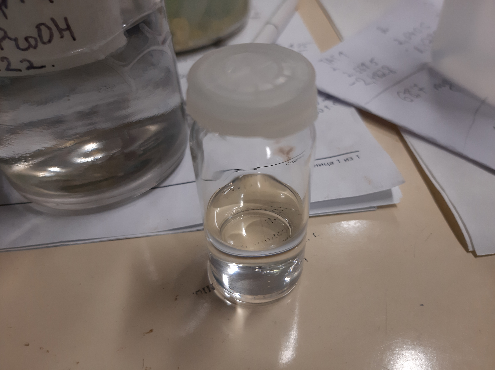
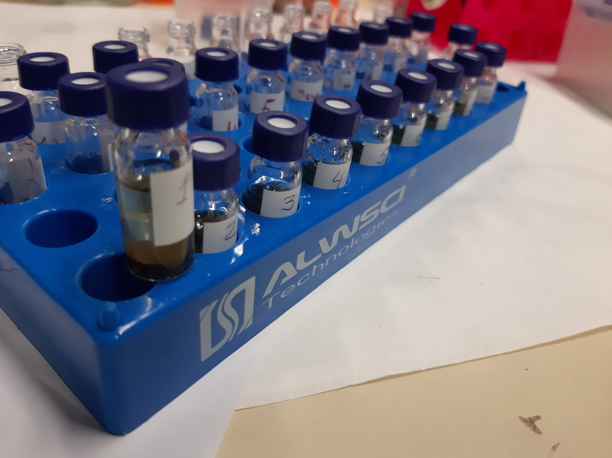

# Опредеоение количественного и качественного состава TL нативной ткани семян *Lunaria rediviva*
:figure-caption: Изображение
:figures-caption: Изображения
:nofooter:
:table-caption: Таблица
:table-details: Детали таблицы

Исходная масса семян: 6.4640 $g$

| ID  | Пустая пробирка, $g$ | Пробирка с веществом, $g$ | Вещество, $mg$ |
| --- | -------------------- | ------------------------- | -------------- |
| 1   | 13.7540              | 15.9055                   | 2.1515         |
| 2   | 13.7926              | 16.0092                   | 2.2166         |
| 3   | 13.8255              | 15.8340                   | 2.0085         |

== Пробы 1, 2, 3, 4

.Масса семян
[cols="4*", frame=all, grid=all]
|===
|ID|$m_0, g$|$m_1, g$|$m_2, g$
|1|13.7540|15.9055|2.1515
|2|13.7926|16.0092|2.2166
|3|13.8255|15.8340|2.0085
|===
.{table-details}
[%collapsible]
====
$m_0$:: Масса пустой пробирки
$m_1$:: Масса пробирки с семенами
$m_2$:: Масса семян
====

. Добавить $CHCl_3$: 15 $???$
. Добавить $CHCl_3$: 5 $???$
. Добавить $H_2O$: 5 $???$
. Добавить $H_2O$: 5 $???$
. Добавить $C_6H_6$: 5 $???$

| ID  | Пустая пробирка, $g$ | Пробирка с веществом, $g$ | Вещество, $g$ |
| --- | -------------------- | ------------------------- | ------------- |
| 1   | 19.9353              | 19.5393                   | 0.3960        |
| 2   | 14.0346              | 13.6419                   | 0.3927        |
| 3   | 13.7643              | 13.4307                   | 0.3336        |

== Изображения

.{empty}
[%collapsible]
====
image:images/20240123_131158.jpg[,24%]
image:images/20240123_134830.jpg[,24%]

image:images/20240123_134849.jpg[,24%]
image:images/20240123_135156.jpg[,24%]

image:images/20240123_140502.jpg[,24%]
image:images/20240123_140508.jpg[,24%]
====
