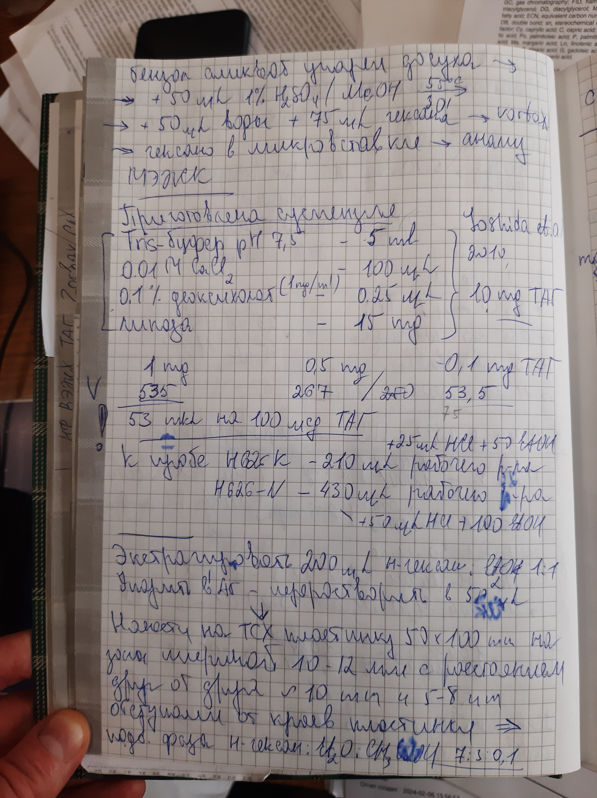
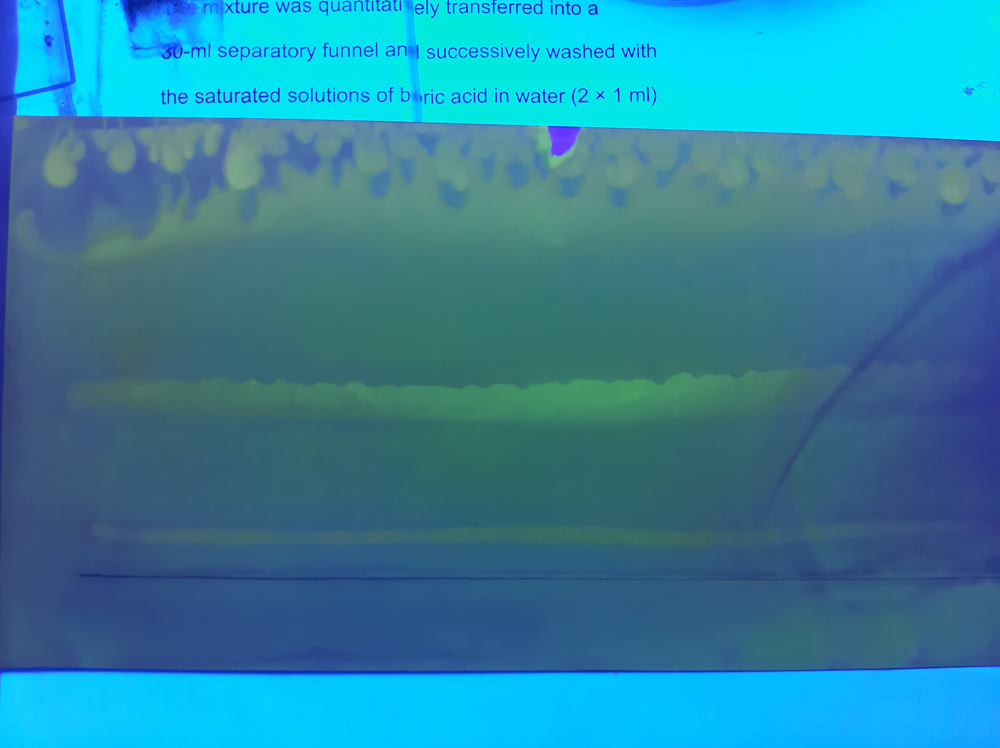

= Определение нативных диглицеридов *Lunaria rediviva*
== Выделение стандарта диглицеридов *Lunaria rediviva*
:nofooter:
:stem:

:suspension: footnote:disclaimer[Opinions are my own.]

.Веса пустых пробирок, пробирок с веществом, вещества
[cols="4*", frame=all, grid=all]
|===
|ID|$m_0,g$|$m_1,g$|$m_2,g$

|1|1.0073|1.0096|0.0023
|2|1.0023|1.0045|0.0022
|===

. Взять 10 пробирок
. Добавить $TAG$: 50 ${\mu}L$
. Добавить:
  * *суспензию* footnote:suspension[
    Объем *суспензии* для 10stem:[mg] *TAG*:pass:c,a,r,m,n,v,p[ +]
    pass:c,a,r,m,n,v,p[* *Tris-buffer 7.5*: 5stem:[mL]]
    ]]: 1200 ${\mu}L$

. Греть 40 $min$, 60 ${\degree}C$
. Слить все в одну пробирку.
. Промыть исходные пробирки раствором link:/substances/mixtures.md#hexaneet_2o[🔗] $[Hexane/Et_2O;1/1,v/v]$ и слить в ту же объединенную пробирку.
. Центрифугировать 3 $min$, 2.3 $g$
. Отобрать верхнюю фазу
. Упарить досуха в токе $Ar$
. ТСХ
    Неподвижная фаза:: $Silica\ gel\ 60$ (Fluca)
    Подвижная фаза:: link:/substances/mixtures.md#hexaneet_2o[🔗] $[Hexane/Et_2O;1/1,v/v]$: 15 $mL$

***

.*Images*:
[%collapsible]
====

====
