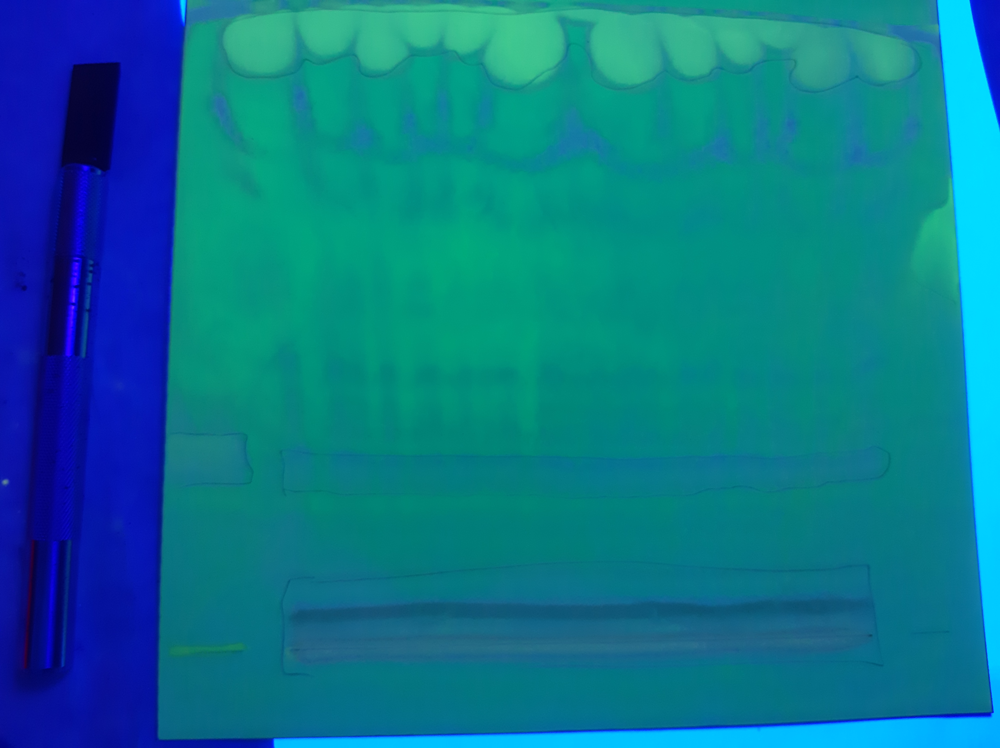

= Определение нативных диглицеридов *Lunaria rediviva*
:figures-caption: Изображения
:nofooter:
:table-caption: Таблица
:table-details: Детали таблицы

== Проба $TL$

. Проба $TL$: 700 ${\mu}L$
+
--
.Экстракт суммарных липидов *Lunaria rediviva*:
[cols="2*", frame=all, grid=all]
|===
|ID|$m, g$
|1|0.3960
|2|0.3927
|3|0.3336
|===
.{table-details}
[%collapsible]
====
$m$:: Масса сухого экстракта, перерастворенного в $CHCl_3$: 5 $mL$
====
--
. Упарить досуха
+
--
.Массы пустых пробирок, пробирок с веществом, веществ
[cols="2*", frame=all, grid=all]
[cols="4*", frame=all, grid=all]
|===
|ID|$m_0, g$|$m_1, g$|$m_2, g$
|1|1.0965|1.1504|0.0539
|2|1.0922|1.1469|0.0547
|3|1.0933|1.1450|0.0517
|===
.{table-details}
[%collapsible]
====
$m_0$:: Масса пустой пробирки
$m_1$:: Масса пробирки с веществом
$m_2$:: Масса вещества
====
--
. Добавить $[CHCL_3/MeOH; 2/1, v/v]$: 300 ${\mu}L$

== $TLC$

Неподвижная фаза:: $Silica\ gel\ 60$ (Supelco)
Подвижная фаза:: $[Hexane/Et_2O; 1/1, v/v]$: 20 $mL$
Проба:: $TL$

. Опрыскать $DCF$
. Получить пробы $PL$ и $DAG$

.{figures-caption}
[%collapsible]
====
[cols="2*", frame=none, grid=none]
|===
|
|image:images/20240305_145714.jpg[]
|===
====

== Проба $PL$

. Добавить $[CHCL_3/MeOH; 2/1, v/v]$: 10 $mL$

== Проба $DAG$

. Добавить $[Hexane/Et_2O; 1/1, v/v]$: 1 $mL$
