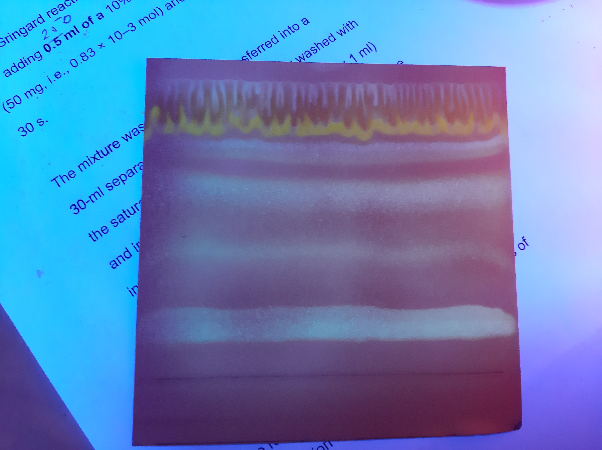
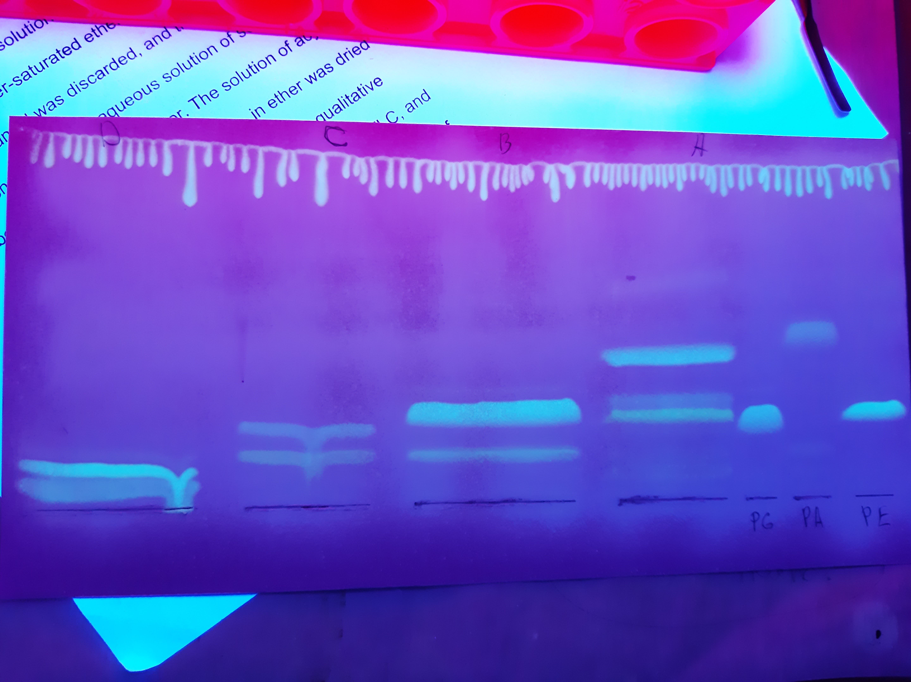

# Анализ [🔗][pl]$PL$ **Lunaria rediviva** методом последовательного одномерного TLC на нескольких пластинках

1. 
   1. TLC
      * $Silica\ gel\ 60$ (Fluca)
      * [🔗][chcl_3meohh_2o]$[CHCL_3/MeOH/H_2O; 30/10/1, v/v/v]$: 41 $mL$
   2. Опрыскать [🔗][primuline]$Primuline$
   3. Собрать 4 пробы: A, B, C, D

2. Для каждой пробы:
   1. Добавить [🔗][chcl_3meoh]$[CHCL_3/MeOH; 2/1, v/v]$: 1 $mL$
   2. Центрифугировать 3 $min$, 2.3 $g$  
      *Повторить второй раз (3-4):*
   3. Добавить [🔗][chcl_3meoh]$[CHCL_3/MeOH; 2/1, v/v]$: 500 ${\mu}L$
   4. Центрифугировать 3 $min$, 2.3 $g$
   5. Добавить $H_2O$: 400 ${\mu}L$
   6. Центрифугировать 3 $min$, 2.3 $g$
   7. Отобрать нижнюю фазу
   8. Упарить досуха
   9. Перерастворить в [🔗][chcl_3meoh]$[CHCL_3/MeOH; 2/1, v/v]$: 70 ${\mu}L$

3. 
   1. TLC
      * $Silica\ gel\ 60$ (Fluca)
      * [🔗][chcl_3meohacetic-acidh_2o]$[CHCL_3/MeOH/Acetic\ acid/H_2O; 80/9/12/2, v/v/v/v]$: 51,5 $mL$
   2. Опрыскать [🔗][dcf]$DCF$
   3. Собрать 10 проб

Относительные коэффициенты удерживания (Retention Factors):

| ID  | Lower | Middle | Upper | Relative |
| --- | ----- | ------ | ----- | -------- |
| FL  | -     | 1512   | -     | 1.00     |
| A   | 1047  | 1109   | 1171  | 0.73     |
| B   | 791   | 886.5  | 982   | 0.59     |
| C   | 532   | 598    | 664   | 0.40     |
| D   | 146   | 237    | 328   | 0.16     |

## Images

 

[chcl_3meoh]: ../substances/mixtures.md#chcl_3meoh
[chcl_3meohacetic-acidh_2o]: ../substances/mixtures.md#chcl_3meohacetic-acidh_2o
[chcl_3meohh_2o]: ../substances/mixtures.md#chcl_3meohh_2o
[dcf]: ../substances/individuals.md#dcf
[pl]: ../substances/individuals.md#pl
[primuline]: ../substances/individuals.md#primuline
[tmsh]: ../substances/individuals.md#tmsh
