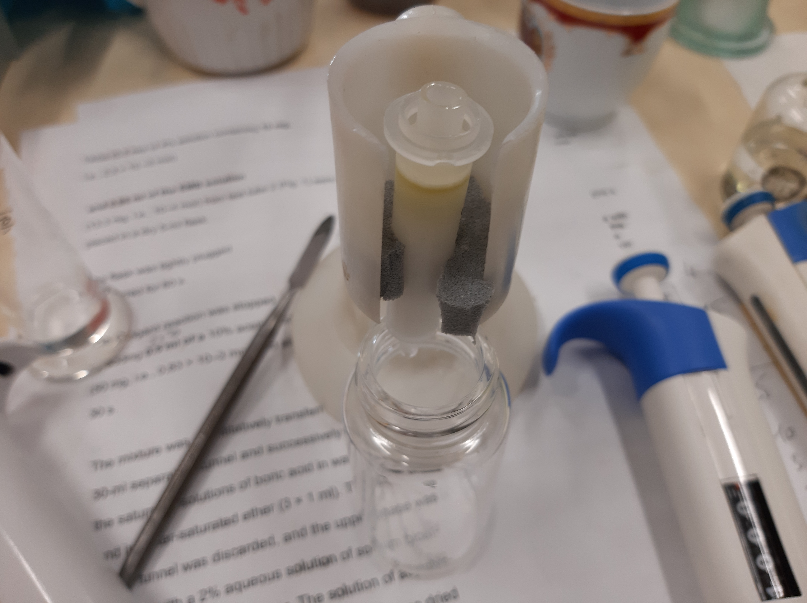

:chcl3_meoh__1_2: $[CHCl_3/MeOH;1/2,v/v]$
:chcl3_meoh__2_1: $[CHCl_3/MeOH;2/1,v/v]$
:chcl3_meoh_h2o__65_25_4: $[CHCl_3/MeOH/H_2O;65/25/4,v/v/v]$
:hexane_et2o__1_1: $[Hexane/Et_2O;1/1,v/v]$
:hexane_et2o_acoh__6_4_005: $[Hexane/Et_2O/AcOH;6/4/0.05,v/v/v]$
:dag: $DAG$
:tag: $TAG$
:ffa: $FFA$
:pc: $PC$
:pe: $PE$
:pl: $PL$
:pma_etoh_h2o: $[PMA/[EtOH/H_2O;80/20,v/v];100/4,m/m]$

= Выделение {pl} **Lunaria rediviva** методом твердофазной экстракции на патронах с силикогелем
:nofooter:
:stem:

[NOTE]
====
. Внесение пробы в патрон следует выполнять равномерно, с постоянной скоростью, по возможности, за один раз.
. Элюирование несколькими растворителями следует проводить в порядке увеличения элюирующей силы растворителя.
====

. Добавить [1]: 500 ${\mu}L$
    | ID  | Пустая пробирка $g$ | Пробирка с веществом $g$ | Вещество $g$ |
    | --- | ------------------- | ------------------------ | ------------ |
    | 1   | 1.0117              | 1.0515                   | 0.0398       |
    | 2   | 1.0115              |                          |              |
    | 3   | 1.0169              |                          |              |
. Упарить досуха
. Растворить в {hexane_et2o__1_1}: 300 ${\mu}L$
. Твердофазная экстракция на патроне с силикогелем:
    .. Промыть {hexane_et2o__1_1}: ~ 5 $mL$
    .. Внести пробу
    .. x10 добавить/отбрать {hexane_et2o__1_1}: 1 $mL$
    .. x10 добавить/отбрать {chcl3_meoh_h2o__1_2}: 1 $mL$
. Упарить досуха
. x20 добавить {chcl3_meoh__2_1}: 200 ${\mu}L$
. ТСХ нейтральных липидов:
    Неподвижная фаза:: $Silica\ gel\ 60$ (Fluca)
    Подвижная фаза:: {hexane_et2o_acoh__6_4_005}: 10 $mL$
    Стандарты::
    * {ffa}: 3 ${\mu}L$
    * {dag}: 3 ${\mu}L$
    * {tag}: 3 ${\mu}L$
    * $Sterin$: 3 ${\mu}L$
    Проба:: x10: 10 ${\mu}L$

    .. Опрыскать {pma_etoh_h2o}
    .. Греть при температуре 100 ${\degree}C$ до проявления

. TLC полярных липидов:
    Неподвижная фаза:: $Silica\ gel\ 60$ (Fluca)
    Подвижная фаза:: {chcl3_meoh_h2o__65_25_4}: 10 ${\mu}L$
    Стандарты::
    * {pc}: 5 ${\mu}L$
    * {pe}: 5 ${\mu}L$
    Проба:: x10: 10 ${\mu}L$

== Обозначения

1. Экстракт суммарных липидов **Lunaria rediviva**, перерастворенный в $CHCl_3$: 5 $mL$:
   | ID  | Масса $g$ |
   | --- | --------- |
   | 1   | 0.3960    |
   | 2   | 0.3927    |
   | 3   | 0.3336    |

.*Images*:
[%collapsible]
====

image:images/20240320_161231.jpg[,25%]
image:images/4c3a37a3-ed47-40ca-bdf7-71e1f46b43f7.jpeg[TLC,100%]
====
