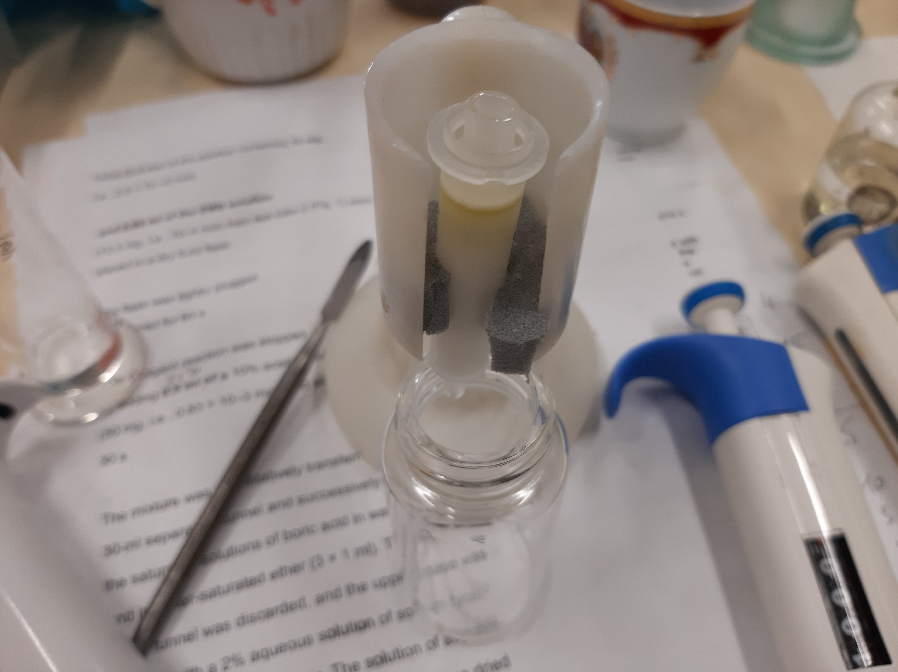

= Выделение $PL$ *Lunaria rediviva* методом SPE на патронах с силикогелем
:figure-caption: Изображение
:figures-caption: Изображения
:nofooter:
:table-caption: Таблица
:table-details: Детали таблицы

[NOTE]
====
. Внесение пробы в патрон следует выполнять равномерно, с постоянной скоростью, по возможности, за один раз, минимальным объемом растворителя
. Элюирование несколькими растворителями следует проводить в порядке увеличения элюирующей силы растворителя.
====

== xref:../2024-01-23/1.adoc#пробы-tl_1-tl_2-tl_3[🔗] Проба $TL_1$

. Проба: 500 ${\mu}L$
. Упарить досуха в токе $Ar$

.Масса пробы
[cols="4*", frame=all, grid=all]
|===
|ID|$m_0, g$|$m_1, g$|$m_2, g$
|$TL_1$|1.0117|1.0515|0.0398
|===
.{table-details}
[%collapsible]
====
$m_0$:: Масса пустой пробирки
$m_1$:: Масса пробирки с пробой
$m_2$:: Масса пробы
====

. Добавить $[Hexane/Et_2O; 1/1, v/v]$: 300 ${\mu}L$
. SPE
.. Промыть $[Hexane/Et_2O; 1/1, v/v]$: ~ 5 $mL$
.. Внести пробу
повторить 10 раз::
Добавить $[Hexane/Et_2O; 1/1, v/v]$: 1 $mL$ и отобрать пробу $NL$
повторить 10 раз::
Добавить $[CHCl_3/MeOH; 1/2, v/v]$: 1 $mL$ и отобрать пробу $PL$

== Пробы $NL_1$ - $NL_10$, $PL_1$ - $PL_10$

Для каждой пробы::
. Упарить досуха
. Добавить $[CHCl_3/MeOH; 2/1, v/v]$: 200 ${\mu}L$

== Пробы $NL_1$ - $NL_10$

Для всех проб::
. Проба: 10 ${\mu}L$
. TLC нейтральных липидов:
Неподвижная фаза::: $Silica\ gel\ 60$ (Fluka)
Подвижная фаза::: $[Hexane/Et_2O/AcOH; 6/4/0.05, v/v/v]$: 10 $mL$
Стандарты:::
* $FFA$: 3 ${\mu}L$
* $DAG$: 3 ${\mu}L$
* $TAG$: 3 ${\mu}L$
* $Sterin$: 3 ${\mu}L$
. Опрыскать link:../substances/mixtures.adoc#pmaetohh_2o8020vv1004mm[🔗] $[PMA/[EtOH/H_2O; 80/20, v/v]; 100/4 ,m/m]$
. Греть при температуре 100 ${\degree}C$ до проявления

== Пробы $PL_1$ - $PL_10$

Для всех проб::
. TLC полярных липидов:
Неподвижная фаза::: $Silica\ gel\ 60$ (Fluka)
Подвижная фаза::: $[CHCl_3/MeOH/H_2O; 65/25/4, v/v/v]$: 10 ${\mu}L$
Проба::: 10 ${\mu}L$
Стандарты:::
* $PC$: 5 ${\mu}L$
* $PE$: 5 ${\mu}L$

.{figures-caption}
[%collapsible]
====
[cols="2*", frame=none, grid=none]
|===
|
|image:images/20240320_161231.jpg[]
2.+|image:images/4c3a37a3-ed47-40ca-bdf7-71e1f46b43f7.jpg[TLC]
|===
====
