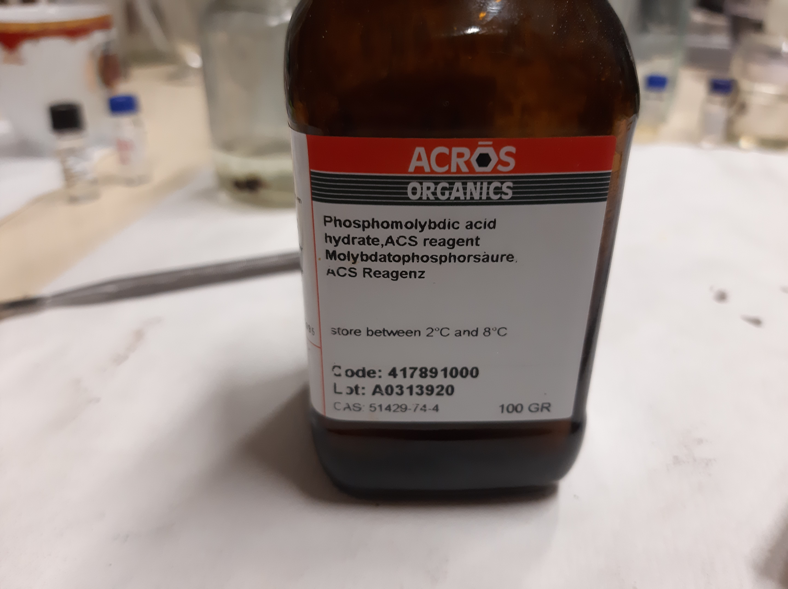
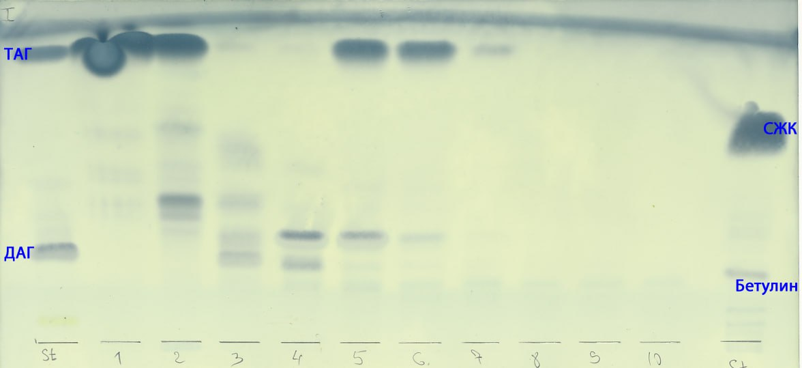

# Выделение полярных липидов (PL) **Lunaria rediviva** методом твердофазной экстракции на патронах с силикогелем

1. Добавить [1]: 500 ${\mu}L$
    | ID  | Пустая пробирка $g$ | Пробирка с веществом $g$ | Вещество $g$ |
    | --- | ------------------- | ------------------------ | ------------ |
    | 1   | 1.0117              | 1.0515                   | 0.0398       |
    | 2   | 1.0115              | 1.                       | 0.           |
    | 3   | 1.0169              | 1.                       | 0.           |
2. Упарить досуха в токе $Ar$
3. Растворить в $Hexane/Et_2O (1/1, v/v)$: 300 ${\mu}L$
4. Твердофазная экстракция на патроне с силикогелем:
   1. Промыть $Hexane/Et_2O (1/1, v/v)$: ~ 5 $mL$
   2. Нанести пробу
   3. x10 добавить/отбрать $Hexane/Et_2O (1/1, v/v)$: 1 $mL$
   4. x10 добавить/отбрать $CHCl_3/MeOH (1/2, v/v)$: 1 $mL$
5. Упарить досуха в 
6. x20 добавить $CHCl_3/MeOH (2/1, v/v)$: 200 ${\mu}L$
7. x2 TLC
   1. **Silica gel 60** (Supelco)
   2. $Hexane/Et_2O/AcOH (6/4/0.05, v/v/v)$: 10 $ml$
   3. 
      1. x10 проба: 10 ${\mu}L$
      2. Стандарты:
         1. $TAG$: 3 ${\mu}L$
         2. $DAG$: 3 ${\mu}L$
         3. $FFA$: 3 ${\mu}L$
         4. $Sterin$: 3 ${\mu}L$
   4. Опрыскать [2]
   5. Греть при температуре 100 $\degree$

## Обозначения

1. Экстракт суммарных липидов **Lunaria rediviva**, перерастворенный в $CHCl_3$: 5 $ml$:
   | ID  | Масса $g$ |
   | --- | --------- |
   | 1   | 0.3960    |
   | 2   | 0.3927    |
   | 3   | 0.3336    |
2. Раствор $PMA/[EtOH/H_2O(80/20, v/v)] (100/4, m/m)$
    1. $EtOH/H_2O(80/20, v/v)$: 87.28 $g$
       1. 80 $ml$ EtOH
       2. 20 $ml$ H_2O
    2. $PMA$: 3,4912 $g$

[^1]