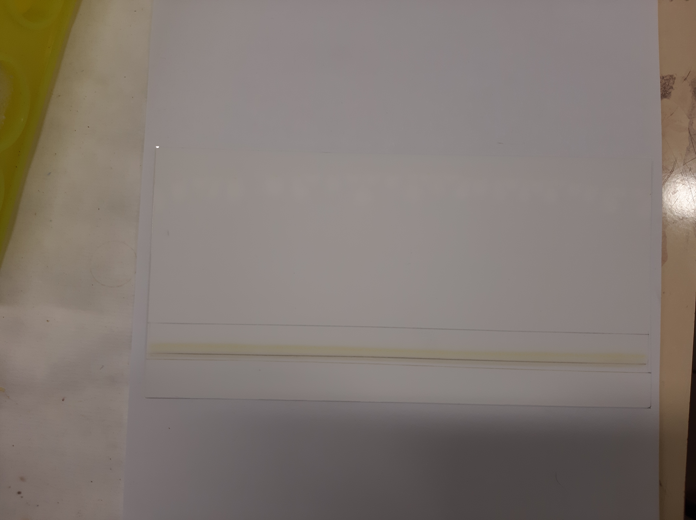
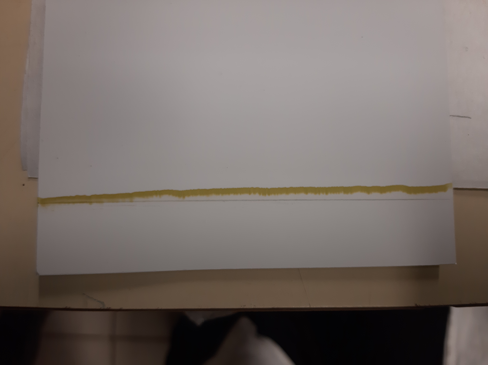
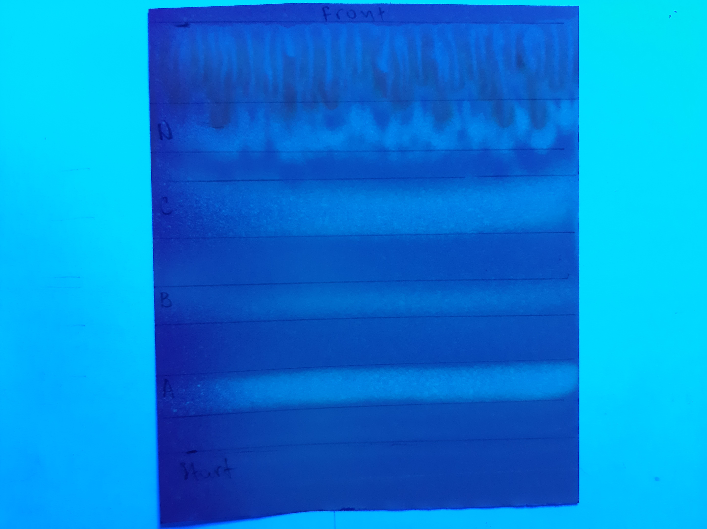
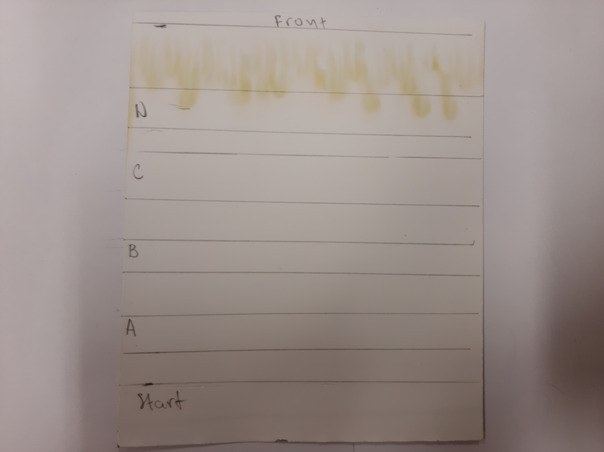
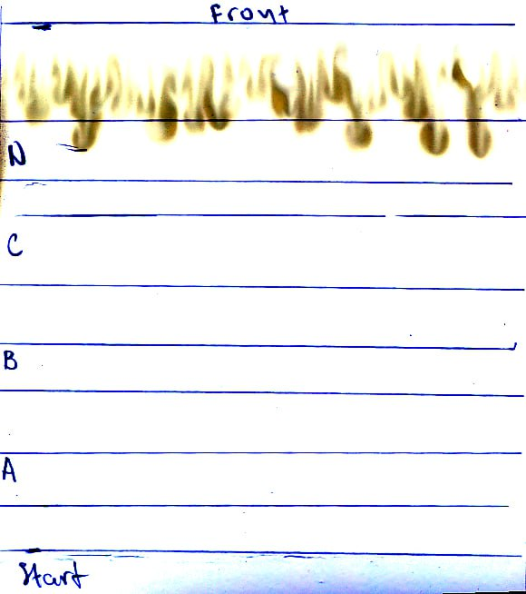
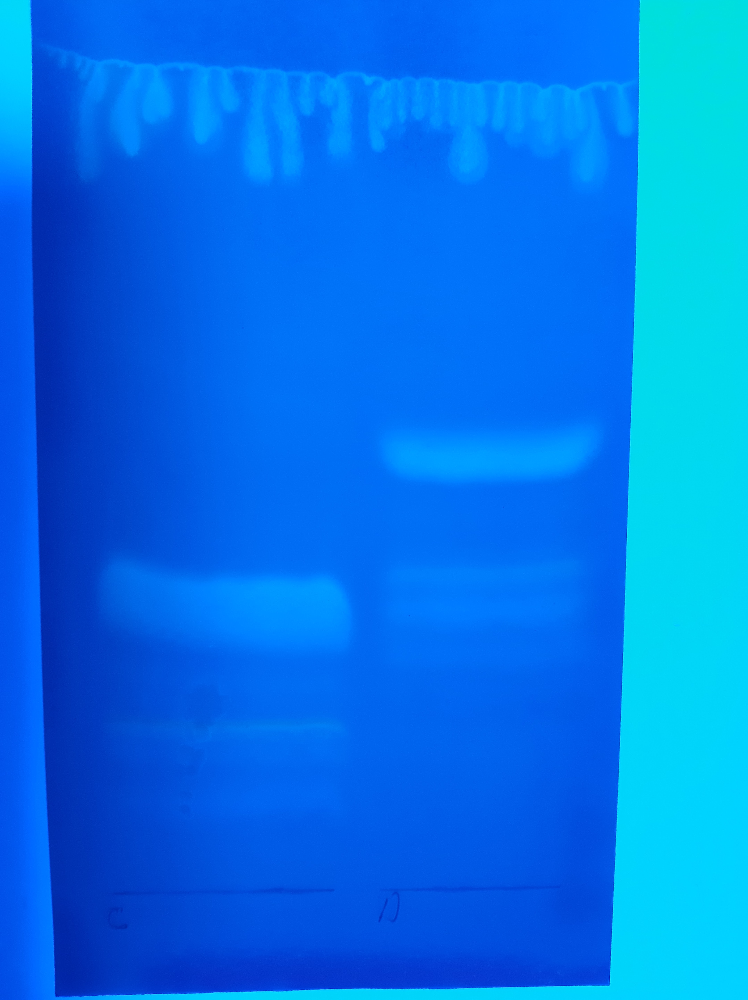
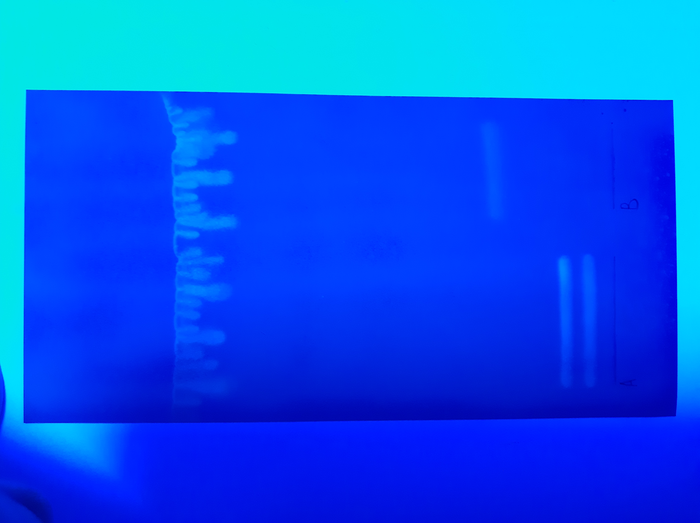
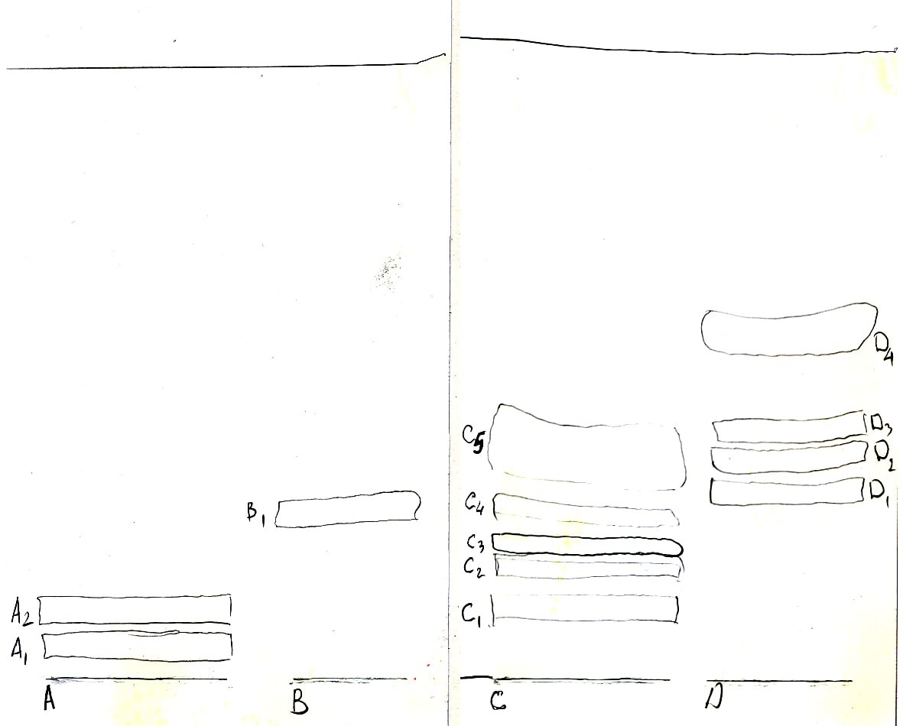

= Анализ $PL$ *Lunaria rediviva* методом двумерного TLC на двух пластинках
:figure-caption: Изображение
:figures-caption: Изображения
:nofooter:
:table-caption: Таблица
:table-details: Детали таблицы

== Пробы $TL_2$, $TL_3$

.Масса экстракта $TL$ *Lunaria rediviva*, перерастворенного в $CHCl_3$: 5 $mL$
[cols="2*", frame=all, grid=all]
|===
|ID|$m, g$
|$TL_2$|0.3927
|$TL_3$|0.3336
|===

Для каждой пробы::
. TLC
Неподвижная фаза::: $Silica\ gel\ 60$ (Fluka)
Подвижная фаза::: $[Hexane/Et_2O; 6/4, v/v]$: 10 $mL$
Проба::: 600 ${\mu}L$
. Отобрать пробы $PL_{21}$, $PL_{22}$, $PL_{31}$, $PL_{32}$

== Пробы $PL_{21}$, $PL_{22}$, $PL_{31}$, $PL_{32}$

.{figures-caption}
[%collapsible]
====
[cols="2*", frame=none, grid=none]
|===
|
|
|===
====

Для каждой пробы:: смыть
. Добавить $[CHCl_3/MeOH; 2/1, v/v]$: 1700 ${\mu}L$
. Центрифугировать 3 $min$, 2.3 $g$
. Отобрать жидкую фазу в 2 пробы: $PL_2$, $PL_3$
. Добавить $[CHCl_3/MeOH; 2/1, v/v]$: 850 ${\mu}L$
. Центрифугировать 3 $min$, 2.3 $g$
. Отобрать жидкую фазу (добавить соответственно в пробы $PL_2$, $PL_3$)

== Пробы $PL_2$, $PL_3$

Для каждой пробы:: очистить
. Добавить $H_2O$: 1700 ${\mu}L$
. Центрифугировать 3 $min$, 2.3 $g$
. Отобрать нижнюю фазу в пробу $PL$
. Упарить досуха в токе $Ar$
. Растворить в $[CHCL_3/Et_2O; 1/1, v/v]$: 400 ${\mu}L$

== Проба $PL$

.Масса пробы
[cols="4*", frame=all, grid=all]
|===
|ID|$m_0, g$|$m_1, g$|$m_2, g$
|$PL$|2.4821|2.4871|0.0050
|===
.{table-details}
[%collapsible]
====
$m_0$:: Масса пустой пробирки
$m_1$:: Масса пробирки с пробой
$m_2$:: Масса пробы
====

. TLC (первое измерение)
Неподвижная фаза:: $Silica\ gel\ 60$ (Fluka)
Подвижная фаза:: $[CHCL_3/MeOH/H_2O; 30/10/1, v/v/v]$: 10 $mL$
. Опрыскать $Primuline$
. Отобрать пробы $A$, $B$, $C$, $D$

== Пробы $A$, $B$, $C$, $D$

.{figures-caption}
[%collapsible]
====
[cols="2*", frame=none, grid=none]
|===
|
|
2.+|
|===
====

.Относительные коэффициенты удерживания
[cols="5*", frame=all, grid=all]
|===
|ID|Lower|Middle|Upper|RF
|A|9|14|19|0.14
|B|30|34.5|39|0.35
|C|50|56.5|63|0.57
|D|70|75.5|81|0.76
|FL|-|99|-|1.00
|===
.{table-details}
[%collapsible]
====
A, B, C, D:: Идентификатор пробы
FL:: Линия фронта
Lower:: Нижняя граница пробы
Middle:: Среднее арифметическое нижней и верхней границ
Upper:: Верхняя граница пробы
RF (Retention Factor):: Относительный коэффициент удерживания
====

Для каждой пробы::
. Добавить $[CHCl_3/MeOH; 2/1, v/v]$: 1500 ${\mu}L$
. Центрифугировать 3 $min$, 2.3 $g$
. Отобрать жидкую фазу
. Добавить $H_2O$: 300 ${\mu}L$
. Центрифугировать 3 $min$, 2.3 $g$
. Отобрать нижнюю фазу
. Упарить досуха в токе $Ar$
. Растворить в $[CHCl_3/MeOH; 2/1, v/v]$: ~ 100 ${\mu}L$

Для всех проб::
. TLC (второе измерение)
Неподвижная фаза::: $Silica\ gel\ 60$ (Fluka)
Подвижная фаза::: $[CHCL_3/MeOH/Acetic\ acid/H_2O; 80/9/12/2, v/v/v/v]$: 10 $mL$
. Опрыскать $Primuline$
. Отобрать пробы $A_1$, $A_2$, $B_1$, $C_1$, $C_2$, $C_3$, $C_4$, $C_5$, $D_1$, $D_2$, $D_3$, $D_4$

== Пробы $A_1$, $A_2$, $B_1$, $C_1$, $C_2$, $C_3$, $C_4$, $C_5$, $D_1$, $D_2$, $D_3$, $D_4$

.{figures-caption}
[%collapsible]
====
[cols="3*", frame=none, grid=none]
|===
|
|
|image:images/20240325_214615.jpg[]
3.+|
|===
====

Для каждой пробы::
. Растворить в $[CHCl_3/MeOH; 2/1, v/v]$: 1500 ${\mu}L$
. Центрифугировать 3 $min$, 2.3 $g$
. Отобрать жидкую фазу
. Добавить $H_2O$: 400 ${\mu}L$
. Центрифугировать 3 $min$, 2.3 $g$
. Отобрать нижнюю фазу
. Упарить досуха под вакуумом
. Растворить в $[CHCl_3/Et_2O; 1/2, v/v]$: 150 ${\mu}L$
