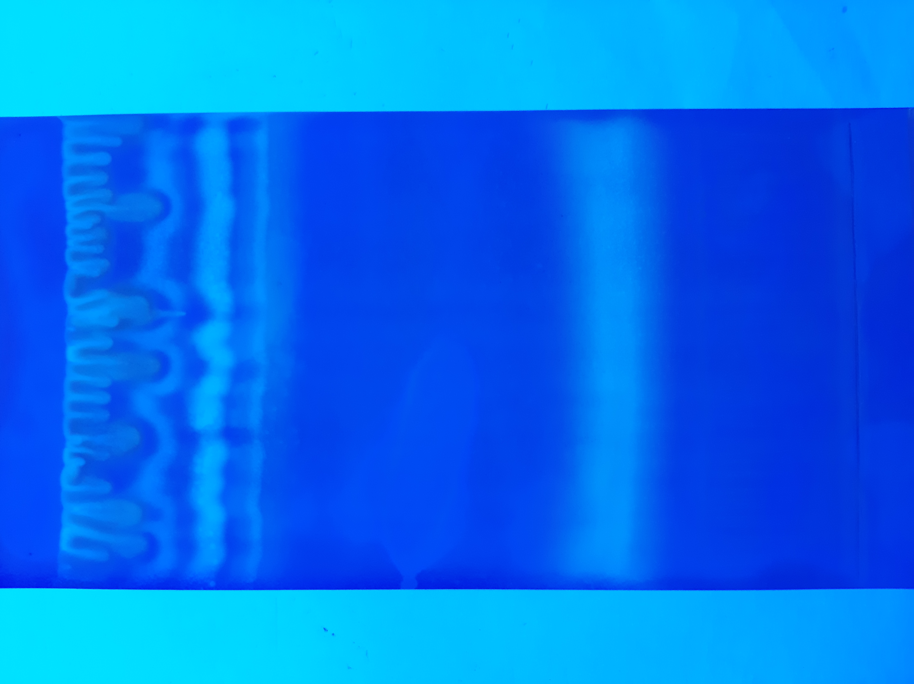
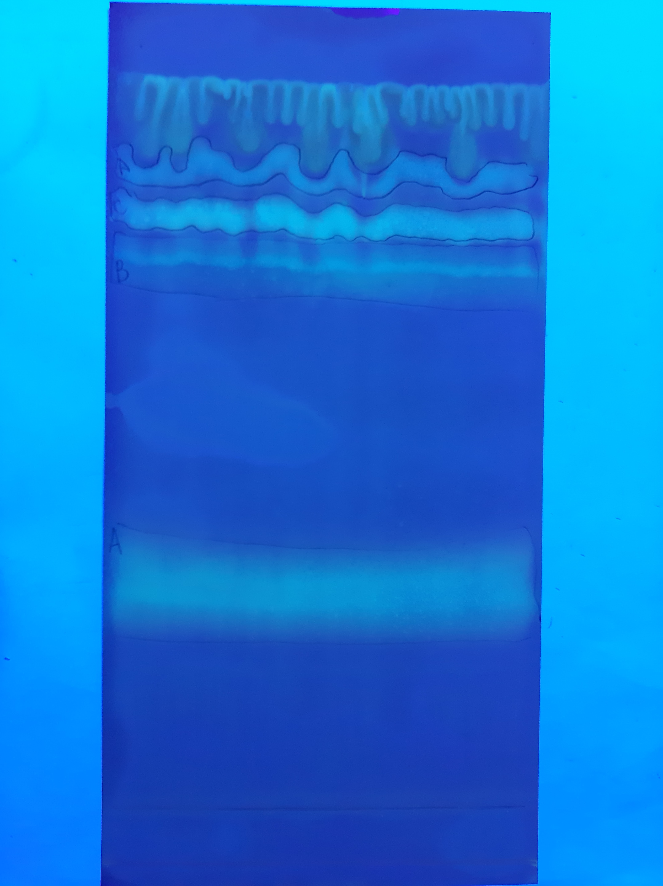
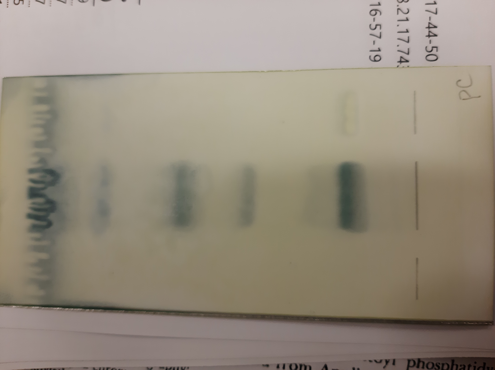
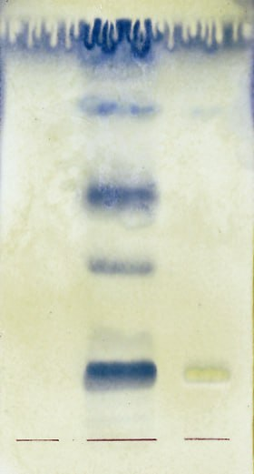
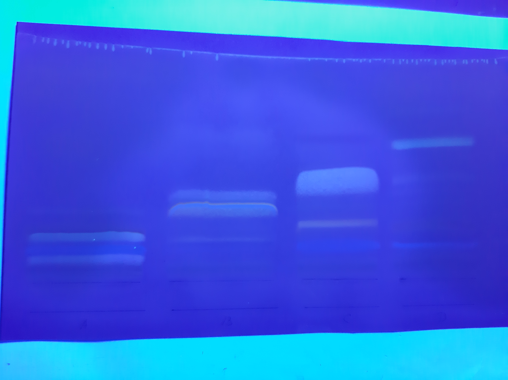
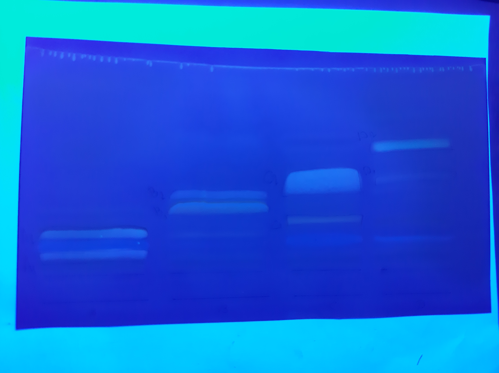

= Выделение $PL$ *Lunaria rediviva* методом SPE на патронах с силикагелем
:figure-caption: Изображение
:figures-caption: Изображения
:nofooter:
:table-caption: Таблица
:table-details: Детали таблицы

== xref:../2024-01-23/1.adoc#пробы-tl_1-tl_2-tl_3[🔗] Проба $TL_2$

. Проба: 600 ${\mu}L$
. Упарить досуха в токе $Ar$

.Масса пробы
[cols="4*", frame=all, grid=all]
|===
|ID|$m_0, g$|$m_1, g$|$m_2, g$
|$TL_2$|1.0925|1.1365|0,044
|===
.{table-details}
[%collapsible]
====
$m_0$:: Масса пустой пробирки
$m_1$:: Масса пробирки с пробой
$m_2$:: Масса пробы
====

. Добавить $[Hexane/Et_2O; 1/1, v/v]$: 150 $mL$
. SPE
.. Промыть $[Hexane/Et_2O; 1/1, v/v]$: ~ 5 $mL$
.. Внести пробу: 150 ${\mu}L$
.. Внести $[Hexane/Et_2O; 1/1, v/v]$: 8 $mL$
.. Отобрать пробу $NL$
.. Внести $[CHCl_3/MeOH; 1/6, v/v]$: 10 $mL$
.. Отобрать пробу $PL$

== Проба $PL$

. Упарить досуха в токе $Ar$
+
.Масса пробы
[cols="4*", frame=all, grid=all]
|===
|ID|$m_0, g$|$m_1, g$|$m_2, g$
|$PL$|1.0951|1.1013|0,0062
|===
+
.{table-details}
[%collapsible]
====
$m_0$:: Масса пустой пробирки
$m_1$:: Масса пробирки с пробой
$m_2$:: Масса пробы
====
. Добавить $[CHCl_3/MeOH; 2/1, v/v]$: 200 ${\mu}L$
. TLC (первое измерение)
Неподвижная фаза:: $Silica\ gel\ 60$ (Fluka): 
Подвижная фаза:: $[CHCL_3/MeOH/H_2O; 30/10/1, v/v/v]$: 20 $mL$
. Опрыскать $Primuline$
. Отобрать пробы $A$, $B$, $C$, $D$

== Пробы $A$, $B$, $C$, $D$

.{figures-caption}
[%collapsible]
====
[cols="2*", frame=none, grid=none]
|===
|
|
|
|
|===
====

. Добавить $[CHCl_3/MeOH; 2/1, v/v]$: 1500 ${\mu}L$
. Центрифугировать 3 $min$, 2300 $g$
. Отобрать жидкую фазу
. Упарить досуха в токе $Ar$
. Добавить $[CHCl_3/MeOH; 2/1, v/v]$: ~ 150 ${\mu}L$

. TLC (второе измерение)
Неподвижная фаза::: $Silica\ gel\ 60$ (Fluka): 20x10
Подвижная фаза::: $[CHCL_3/MeOH/Acetic\ acid/H_2O; 80/9/12/2, v/v/v/v]$: 20 $mL$
. Опрыскать $Primuline$
. Отобрать пробы $A_1$, $A_2$, $B_1$, $B_2$, $C_1$, $C_2$, $D_1$, $D_2$

== Пробы $A_1$, $A_2$, $B_1$, $B_2$, $C_1$, $C_2$, $D_1$, $D_2$

.{figures-caption}
[%collapsible]
====
[cols="2*", frame=none, grid=none]
|===
|
|
|===
====

. Добавить $[H_2SO_4/MeOH; 1\%]$: 200 ${\mu}L$
. Греть 30 $min$, 55 ${\degree}C$
. Добавить $H_2O$: 100 ${\mu}L$
+
NOTE: Половина от $[H_2SO_4/MeOH; 1\%]$!
. Добавить $Heptane$: 200 ${\mu}L$
. Отобрать верхнюю фазу
