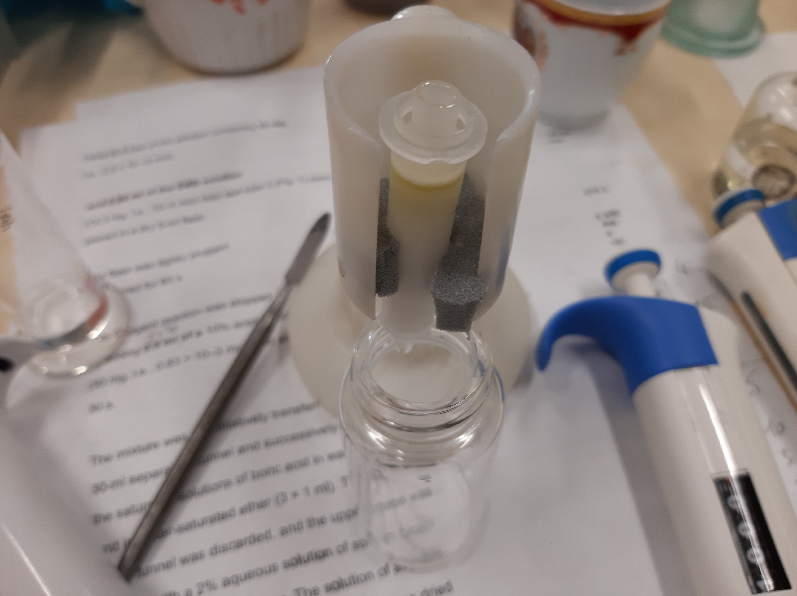

# Выделение [🔗][pl]$PL$ **Lunaria rediviva** методом SPE на патронах с силикагелем

1. Добавить [1]: 500 ${\mu}L$
    | ID  | Пустая пробирка $g$ | Пробирка с веществом $g$ | Вещество $g$ |
    | --- | ------------------- | ------------------------ | ------------ |
    | 1   | 1.0117              | 1.0515                   | 0.0398       |
    | 2   | 1.0115              |                          |              |
    | 3   | 1.0169              |                          |              |
2. Упарить досуха
3. Добавить [🔗][hexaneet_2o]$[Hexane/Et_2O; 1/1, v/v]$: 300 ${\mu}L$
4. Твердофазная экстракция на патроне с силикагелем:
   1. Промыть [🔗][hexaneet_2o]$[Hexane/Et_2O; 1/1, v/v]$: ~ 5 $mL$
   2. Внести пробу
   3. x10 добавить/отбрать [🔗][hexaneet_2o]$[Hexane/Et_2O; 1/1, v/v]$: 1 $mL$
   4. x10 добавить/отбрать [🔗][chcl_3meoh]$[CHCl_3/MeOH; 1/2, v/v]$: 1 $mL$
5. Упарить досуха
6. x20 добавить [🔗][chcl_3meoh]$[CHCl_3/MeOH; 2/1, v/v]$: 200 ${\mu}L$
7. TLC нейтральных липидов:
   1. $Silica\ gel\ 60$ (Fluca)
   2. x10 проба: 10 ${\mu}L$
   3. Стандарты:
      1. $TAG$: 3 ${\mu}L$
      2. $DAG$: 3 ${\mu}L$
      3. $FFA$: 3 ${\mu}L$
      4. $Sterin$: 3 ${\mu}L$
   4. [🔗][hexaneet_2oacoh]$[Hexane/Et_2O/AcOH; 6/4/0.05, v/v/v]$: 10 $mL$
   5. Опрыскать [🔗][pmaetohh_2o]$[PMA/[EtOH/H_2O; 80/20, v/v]; 100/4,m/m]$
   6. Греть при температуре 100 ${\degree}C$ до проявления
8. TLC полярных липидов:
   1. $Silica\ gel\ 60$ (Fluca)
   2. [🔗][chcl_3meohh_2o]$[CHCl_3/MeOH/H_2O; 65/25/4, v/v/v]$: 10 ${\mu}L$
   3. x10 проба: 10 ${\mu}L$
   4. Стандарты:
      1. [🔗][pc]$PC$: 5 ${\mu}L$
      2. [🔗][pe]$PE$: 5 ${\mu}L$

> [!NOTE]
> 1. Внесение пробы в патрон следует выполнять равномерно, с постоянной скоростью, по возможности, за один раз.
> 2. Элюирование несколькими растворителями следует проводить в порядке увеличения элюирующей силы растворителя.

## Обозначения

1. Экстракт суммарных липидов **Lunaria rediviva**, перерастворенный в $CHCl_3$: 5 $mL$:
   | ID  | Масса $g$ |
   | --- | --------- |
   | 1   | 0.3960    |
   | 2   | 0.3927    |
   | 3   | 0.3336    |

## Images

 

[chcl_3meoh]: substances/mixtures.md#chcl_3meoh
[chcl_3meohh_2o]: substances/mixtures.md#chcl_3meohh_2o
[hexaneet_2o]: substances/mixtures.md#hexaneet_2o
[hexaneet_2oacoh]: substances/mixtures.md#hexaneet_2oacoh
[pc]: substances/individuals.md#pc
[pe]: substances/individuals.md#pe
[pl]: substances/individuals.md#pl
[pmaetohh_2o]: substances/mixtures.md#pmaetohh_2o
