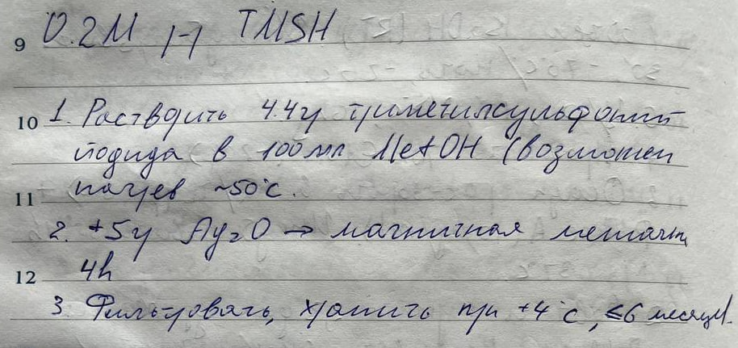

# Individuals

## $DCF$

### Name

- 🇬🇧: Dichlorofluorescein
- 🇷🇺: Дихлорфлуоресцеин

### Links

- <https://en.wikipedia.org/wiki/Dichlorofluorescein>

## $PC$

### Name

- 🇬🇧: Phosphatidylcholines

### Links

- <https://en.wikipedia.org/wiki/Phosphatidylcholine>

## $PE$

### Name

- 🇬🇧: Phosphatidylethanolamine

### Links

- <https://en.wikipedia.org/wiki/Phosphatidylethanolamine>

## $PMA$

### Name

- 🇬🇧: Phosphomolybdic acid

### Links

- <https://en.wikipedia.org/wiki/Phosphomolybdic_acid>

### Images

## $Primuline$

> [!NOTE]
> Неразрушающий проявитель.

### Name

- 🇬🇧: Primuline
- 🇷🇺: Примулин

### Links

- <https://en.wikipedia.org/wiki/Primuline>

### Images

## $TMSH$

### Name

- 🇬🇧: Trimethylsulfonium hydroxide

### Links

- <https://pubchem.ncbi.nlm.nih.gov/compound/Trimethylsulfonium-hydroxide>

### Images

